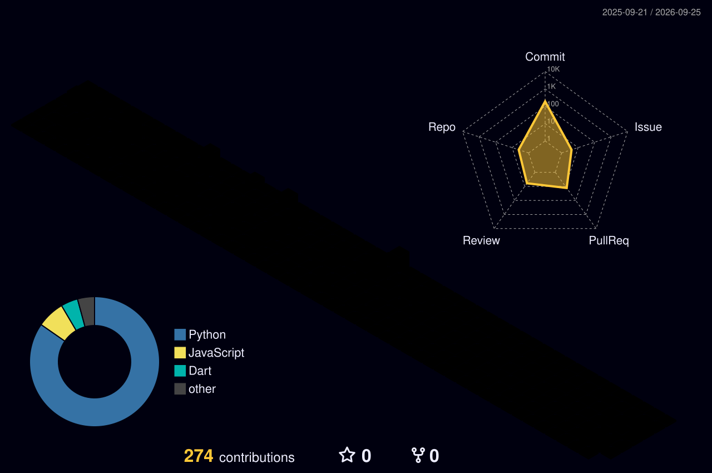

# Salut, moi c'est Joris ! 👋

<!-- Bannière d'en-tête dynamique style anmol098 -->

**Apprenti Développeur d'Applications 💻 | Étudiant en BUT Informatique 🎓**

---

### 💫 À propos de moi

<table>
  <tr>
    <td width="60%" valign="top">

- 🎓 Étudiant en 3e année de **BUT Informatique** à l'IUT d'Orléans *(spécialité Réalisation d'Applications)*.
- 💼 Développeur en alternance chez **DGA Techniques terrestres**.
- 🛠️ Stack de prédilection : **Python (Django)**, **JavaScript (HTMX)**, **Java**, **SQL**.
- 🏛️ Ancien **Président du Bureau des Étudiants (BDE)** de l'IUT d'Orléans.
- 📜 Titulaire d'une certification d'anglais **Cambridge C1**.
- 📷 En dehors du code : passionné par la **photographie**, le sport automobile et l'horlogerie.

    </td>
    <td width="40%" align="center" valign="middle">
      
    </td>
  </tr>
</table>

---

### 🛠️ Compétences & Technologies

#### Langages de programmation

#### Frameworks & Web

#### Données, Systèmes & Outils

---

### 📊 Activité GitHub (3D Night Rainbow)

  
   
  <em>Les contributions quotidiennes sur dépôts internes et professionnels sont synchronisées automatiquement.</em>

---

### 📬 Me retrouver

  
  &nbsp;&nbsp;
  

<!-- Vague de pied de page style anmol098 -->

